# _Richie's Golden Mile_

---

[Richie's Golden Mile](https://alirua.github.io/richies-golden-mile/) is a website for an annual charity fundraising open-water swim.

Here a potential participant can learn what the Golden Mile is, where it is, when it is and how to register interest in joining.

---

## Technologies used

- HTML
- CSS
- Font Awesome icons
- Google fonts

---

## User stories

- As a first time visitor, I want to understand from the website, what I can learn about the swim.
- As a first time visitor, I want to be able to easily navigate through the website, so I can find the information I am looking for.
- As a first time visitor, I want to see the information about the location, date and time of the swim, so I can consider participating.
- As a first time visitor, I want to see the information about how the saftey of the swim is managed.
- As a first time visitor, I want to see some materials used in teaching process, so I can become familiar with it.
- As a first time user, I want the website to have a gallery, so I can browse photos from previous events.
- As a user, I want the website to have a contact form page, so I cant easily register my interest.
- As a mobile device user, I want the website to be responsive, so I can use my phone or tablet to visit it.

---

## Features

### Home page

- ##### Navigation

  - Positioned at the top of the page.
  - Contains text logo of the swim event at the left corner.
  - At the right side there are navigation links:
    - Home - leads to the home page.
    - Gallery - leads to the gallery page.
    - Register - leads to the contact form page.
  - The link of the page that the user currently on is underlined.
  - The links have basic animated hover effect.
  - The navigation is clear and easy to understand for the user.
  - The navigation bar is responsive on all devices.

  
  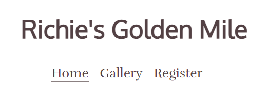

---

- ##### Hero section
  - Hero section has 4 main background images.
  - Hero section splits the images up with a Parallax effect and implements three spanned sections detailing the site information
  - These text blocks tell the user:
    - What the Golden Mile is and the experience level needed to participate.
    - It tells the user the location of the swim, its distance, the date and time of the swim.
    - It tells the user the safety aspect of the swim and also the fundraising information.
    - It shows a styled button that can be clicked, and directs the user to the registration section of the site.
      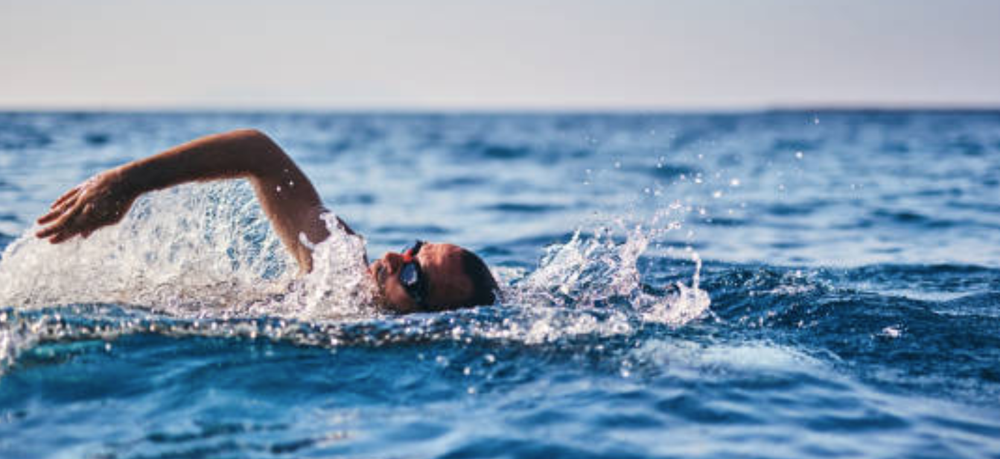
      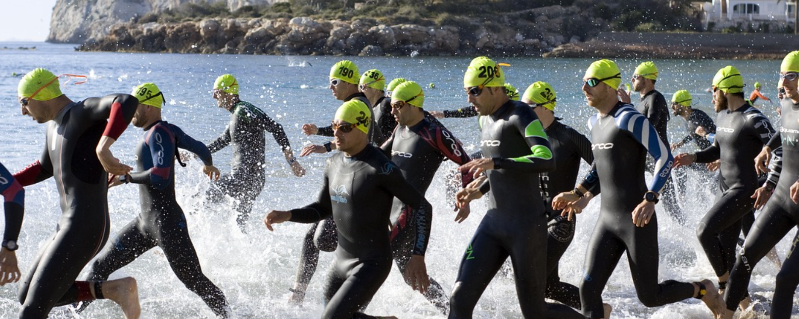
      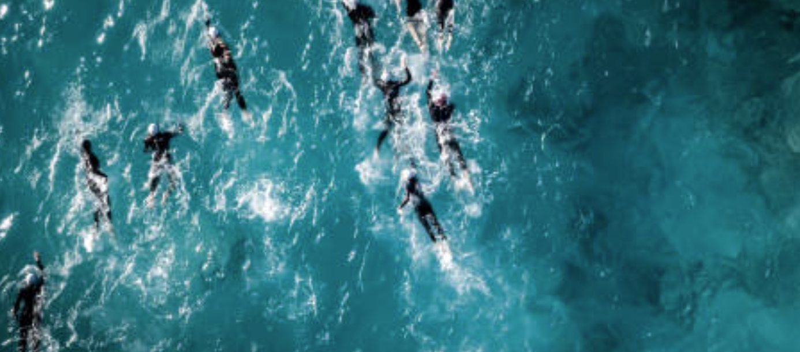
      
      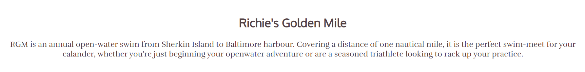
      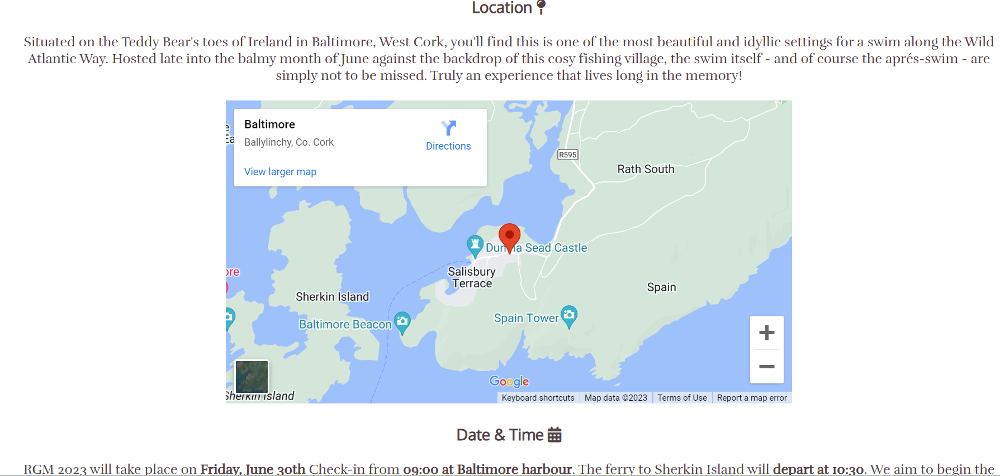
      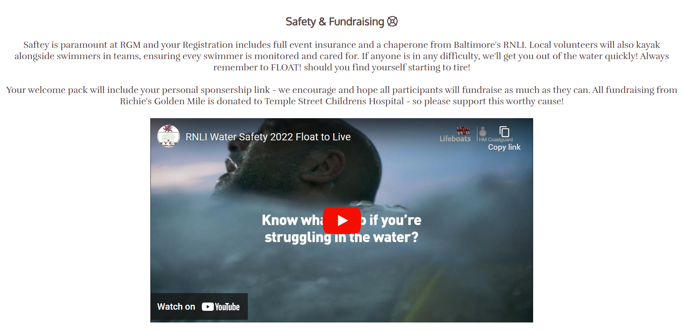

---

- #### Gallery page

  - Contains pictures of different years of the swim.
  - Pictures are displayed in a grid and have preselected styling of normal, tall, wide, and big.
  - The gallery page is responsive:
    - There are three columns in desktop mode.
    - There are two columns on smaller screens and on mobile devices in landscape mode.
    - There is only one column on mobile devices in portrait mode.

  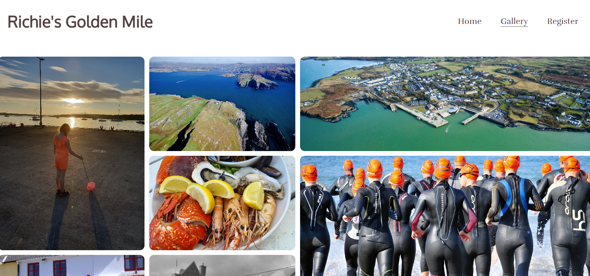

---

- #### Register page

  - This page has a contact form:
    - All text input fields are customized and change color with containing text.
    - The submit button is animated on hover.
  - The page is responsive and look good on all common screen sizes.
  - Submitting the form leads to the hidden response page that contains thank you message.

  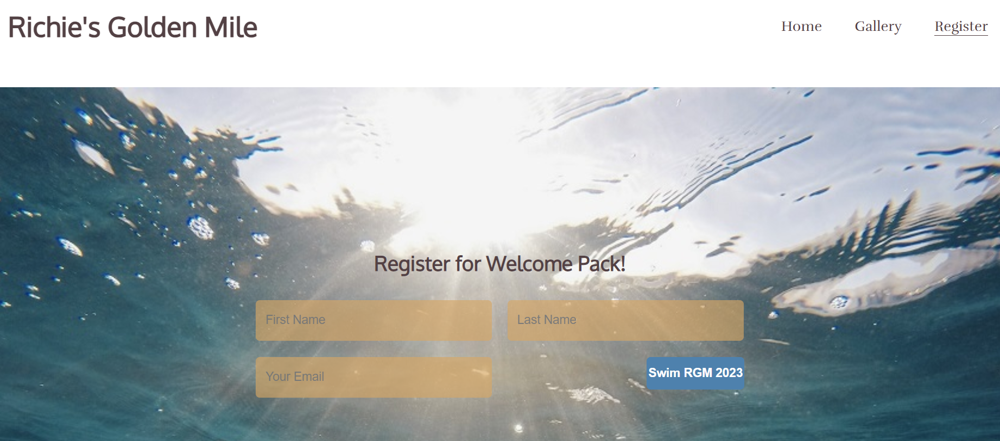
  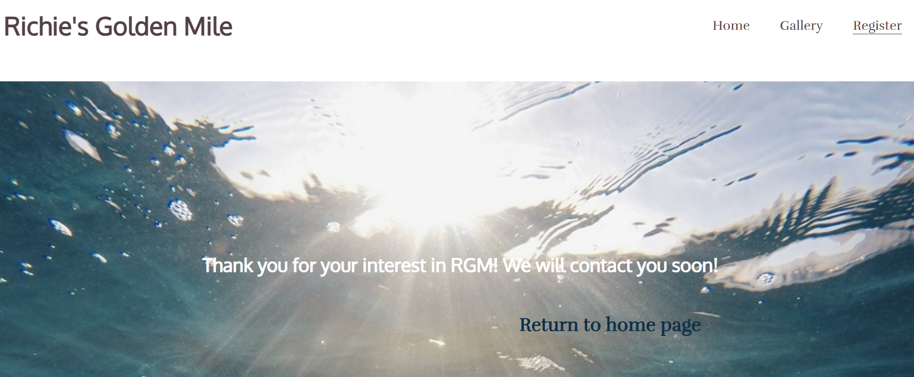

---

### Testing

- I tested that the website works in different browsers: Chrome, Firefox, Microsoft Edge.
- I used devtools to confirm that the website is responsive, looks and functions as it supposed to on all standard screen sizes.
- I tested all the links and confirmed that all of them work and lead where they suppose to lead.

### Bugs

- ##### Solved bugs
  - A bug appeared in the Gallery section on mobile devices. Two columns were set but the right column images would squash and were not viewable.
  - I fixed it by adding another breakpoint specifically for devices under 360px and set the colummn display to one only.
  ***

  - Another small bug I found was the font color on the Register and Response pages was difficult to see on smaller devices due to the position of the background image.
  - I resolved this issue by simply changing the font color to contrast all aspects of the background image.

- ##### Unsolved bugs
  - None.

---

### Validator testing

- ##### HTML
  - No errors or warnings were found when passing through the official W3C validator.
- ##### CSS
  - No errors or warnings were found when passing through the official W3C (Jigsaw) validator.
- ##### Accessibility and performance
  - Using lighthouse in devtools I confirmed that the website is performing well, accessible and colors and fonts chosen are readable.
    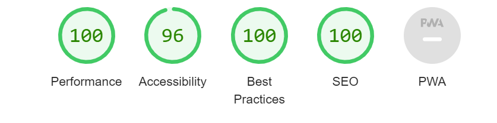

---

### Deployment

- The website was deployed to GitHub pages and can be accessed by the link: [Richie's Golden Mile](https://alirua.github.io/richies-golden-mile/).

---

### Credits

- ##### Content
  - The code to make social media links was taken from the Code Institute [Love Running](https://alirua.github.io/love-running/) project and styled to my site.
  - To make animated input fields I watched a video by [Coding Snow](https://alirua.github.io/love-running/) on their YouTube channel.
  - Some color palette schemes were taken from [Coolers](https://coolors.co/)
  - For some responsive aspect ratio guidance I used [CSS-Tricks](https://css-tricks.com/)
- ##### Media
  - Some images for the website were taken from [Pixabay](https://pixabay.com/images/search/free%20images/)
  - Most of the images were my own or families.

---

#### Wireframes
